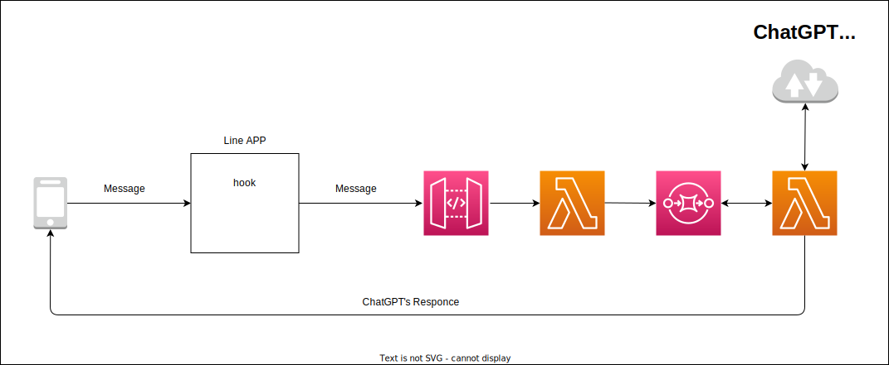

# ChatGPT with Line

This system is a bridge between the Line API and ChatGPT API. 
Ordinary, using the ChatGPT needs to log in to the console. 
It is a troublesome thing for me, especially when I'm going out. 
So, this application was created.

## Structure

This system uses the [Line](https://line.me/en/), it is a chat application, as a UI. 
A user inputs a text that question to the ChatGPT and sends it, the text is sent to the Lambda via API Gateway on this system. 
Once Lambda gets the text, lambda sends the text SQS and returns success status code. 
After that other lambda is invoked, it sends the text to the ChatGPT and gets a response from that and sends the response to the user. 

The reason for using SQS is that API Gateway has a timeout limitation of 30 sec. 
ChatGPT's response sometimes takes time to reply more than 30 sec, which means it will over the API Gateway's limitation. 
So, this system use the SQS and tw lambda functions. 

## Deployment

This system uses [CDK](https://aws.amazon.com/cdk/?nc1=h_ls) to deploy this system.
To deploy, run the deploy command of the CDK.

### Environment Value

| Environment Value    | Description                |
| :------------------- | :------------------------- |
| API_KEY              | ChatGPT's API KEY          |
| CHANNEL_ACCESS_TOKEN | Line's Chanel Access token |
| CHANNEL_SECRET       | Line's Chanel Secret token |
